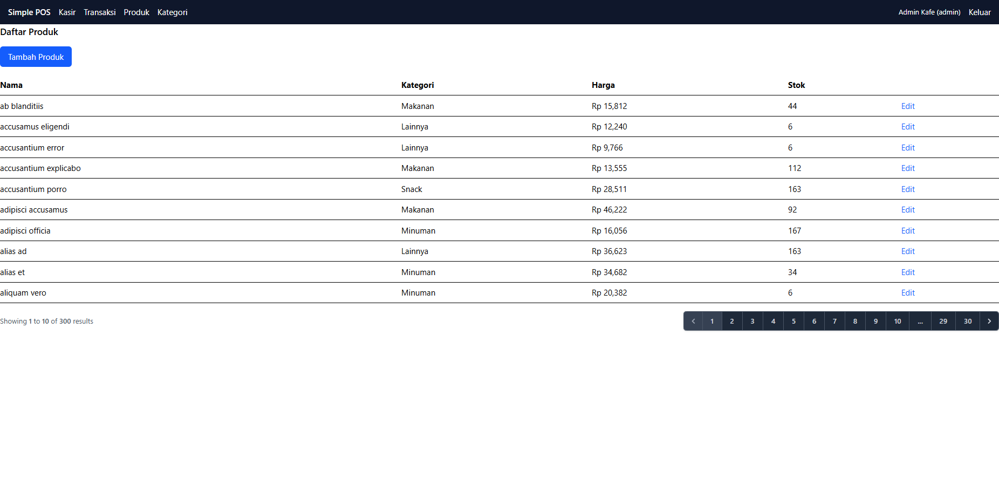
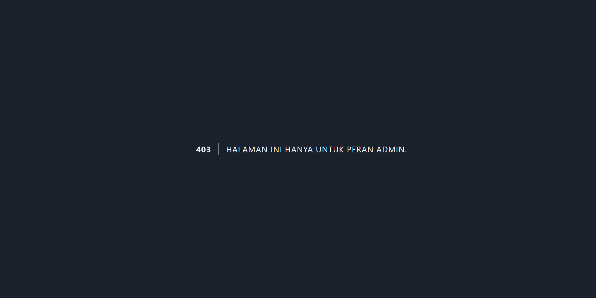
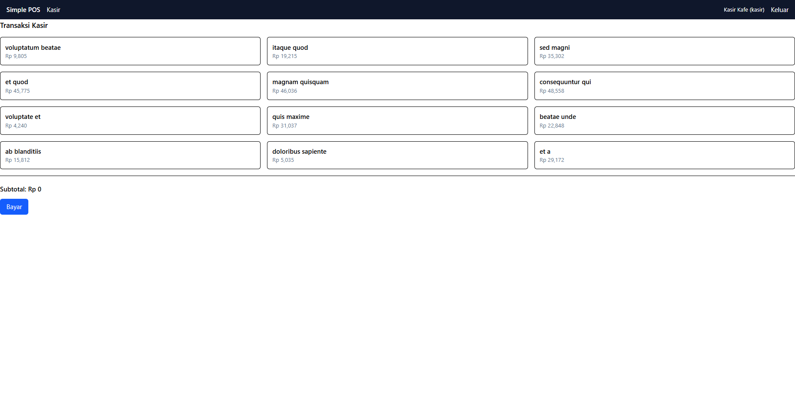
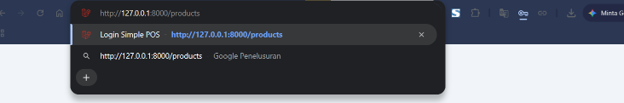
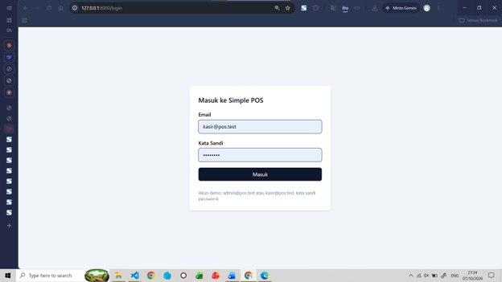
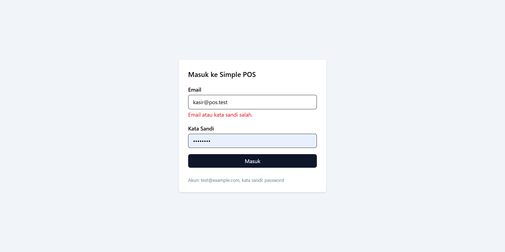
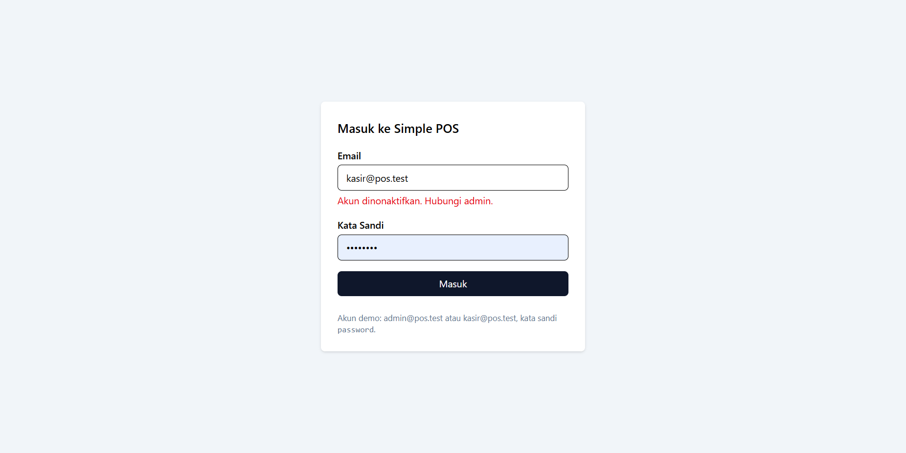
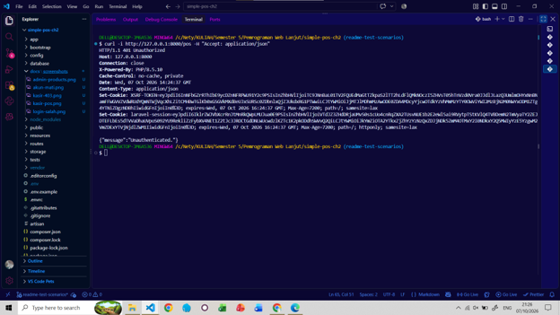

# Simple POS - Laporan Praktikum Pertemuan 6

Repositori ini digunakan untuk pengerjaan tugas kelompok mata kuliah Pemrograman Web Lanjut. Berikut adalah penjelasan dan analisis terkait keamanan manipulasi total transaksi dari masing-masing anggota kelompok (Langkah 6 Poin 5):

---

### Analisis Keamanan Manipulasi Total Transaksi

* **Dian Paramitha:**
  Tidak cukup, validasi numeric belum cukup untuk mencegah manipulasi. Dikarenakan validasi numeric hanya memeriksa tipe data, bukan kebenaran nilai jadi hanya memastikan bahwa data yang dikirim berbentuk angka, tidak memverifikasi apakah hasil penjumlahan dari harga barang sudah dikalikan dengan kuantitas. Jadi ada kemungkinan manipulasi nilai total barang/belanja melalui inspect element ataupun postman/cURL ketika nilai dimanipulasi, server akan tetap menganggap data tersebut valid karena nilai yang diinput adalah angka. Jadi untuk menjaga validasi data, input dari form di sisi klien hanya mengirimkan referensi produk dan kuantitas, sedangkan perhitungan subtotal serta total akhir dilakukan mandiri di sisi server dimana harganya diambil langsung dari database.
  

* **Nafisah Aliyah Khumaini:**
  Tidak cukup, karena validasi numeric hanya memastikan bahwa nilai total berupa angka, bukan memastikan bahwa nilainya benar. User masih dapat memanipulasi nilai total melalui request. Oleh karena itu, server sebaiknya menghitung ulang total berdasarkan data yang dikirim, seperti harga produk dan jumlah barang, kemudian menggunakan hasil perhitungan server sebagai nilai yang dipercaya.

* **Agnes Titania Kinanti:**
  Tidak, validasi numeric saja belum cukup untuk mencegah manipulasi total transaksi. Validasi tersebut hanya memastikan nilai total yang dikirim berupa angka, tetapi pengguna masih bisa mengubah nilai tersebut sebelum dikirim ke server. Jadi, total transaksi tetap bisa dimanipulasi meskipun sudah divalidasi sebagai angka. Cara yang lebih aman adalah server menghitung ulang total berdasarkan harga produk yang tersimpan di database dan jumlah (qty) yang dikirim. Dengan begitu, total yang disimpan berasal dari perhitungan server dan tidak bergantung pada nilai total dari form.
  

* **Nety Sulistyorini:**
Hal tersebut belum cukup untuk mencegah manipulasi total, semua itu disebabkan karena aturan numeric cuma memvalidasi bahwa total berbentuk angka, bukan bahwa angka itu benar. Sebab form berasal dari sisi klien, pengguna tetap bisa mengubah total melalui DevTools atau mengirim POST langsung dengan Postman/curl, contohnya menurunkannya jadi 1. Server yang hanya bergantung pada validasi ini akan menyimpan angka palsu tersebut. Maka dari itu, server harus menghitung sendiri total berdasarkan harga produk di database, bukan mengikuti input klien. Intinya: data dari klien tidak boleh dipercaya untuk hal kritikal seperti harga atau total.
  

* **Pranata Putrandana:**
  Tidak, hal tersebut sama sekali tidak cukup untuk mencegah manipulasi. Validasi berbasis aturan numeric hanya berfungsi untuk memastikan bahwa format data yang dikirimkan berupa angka, bukan untuk menjamin keabsahan nominalnya.Data yang dikirimkan melalui form atau payload HTTP dari sisi klien sangat rentan direkayasa menggunakan browser developer tools atau alat eksekusi seperti cURL. Oleh karena itu, integritas sistem Point of Sale (POS) harus dijaga dengan cara mengabaikan total kiriman luar dan mewajibkan server untuk menghitung ulang seluruh subtotal serta total transaksi secara mutlak berdasarkan harga referensi yang valid di dalam database.

# Skenario Uji Manual — Autentikasi & Otorisasi Pertemuan 7

Bagian ini menjelaskan skenario pengujian manual untuk memastikan autentikasi dan pembatasan peran berjalan sesuai harapan.
---

### Akun Demo

| Peran | Email | Password |
|---|---|---|
| Admin | `admin@pos.test` | `password` |
| Kasir | `kasir@pos.test` | `password` |

### Skenario 1: Admin Membuka Halaman Produk

1. Buka `/login`
2. Login dengan `admin@pos.test` / `password`
3. Buka `/products`

**Hasil yang diharapkan:** Halaman daftar produk tampil normal. Navigasi menampilkan menu Kasir, Transaksi, Produk, dan Kategori.

### Skenario 2: Kasir Ditolak Membuka Halaman Produk

1. Buka `/login`
2. Login dengan `kasir@pos.test` / `password`
3. Buka `/products`

**Hasil yang diharapkan:** Halaman error 403 dengan pesan "Anda tidak memiliki akses untuk halaman ini." Menu Produk dan Kategori tidak muncul di navigasi.

### Skenario 3: Kasir Membuka Halaman Kasir

1. Login sebagai `kasir@pos.test`
2. Buka `/pos`

**Hasil yang diharapkan:** Halaman kasir tampil normal.

### Skenario 4: Tamu Membuka Halaman Terlindungi

1. Pastikan belum login
2. Buka `/products` langsung dari address bar

**Hasil yang diharapkan:** Diarahkan otomatis ke `/login`.

### Skenario 5: Login dengan Kata Sandi Salah

1. Buka `/login`
2. Isi email `admin@pos.test` dengan kata sandi `salah`

**Hasil yang diharapkan:** Muncul pesan "Email atau kata sandi salah."

### Skenario 6: Akun Dinonaktifkan

1. Di tinker: `App\Models\User::where('email', 'kasir@pos.test')->update(['is_active' => false]);`
2. Login sebagai `kasir@pos.test`

**Hasil yang diharapkan:** Pesan "Akun dinonaktifkan. Hubungi admin."

### Skenario 7: Request JSON Tanpa Login (401 vs 403)

1. Belum login
2. Jalankan: `curl -i http://127.0.0.1:8000/pos -H "Accept: application/json"`

**Hasil yang diharapkan:** Status `401 Unauthorized`.

Perbedaan **401** & **403**:
- **401** = belum login
- **403** = sudah login, tapi tidak punya izin